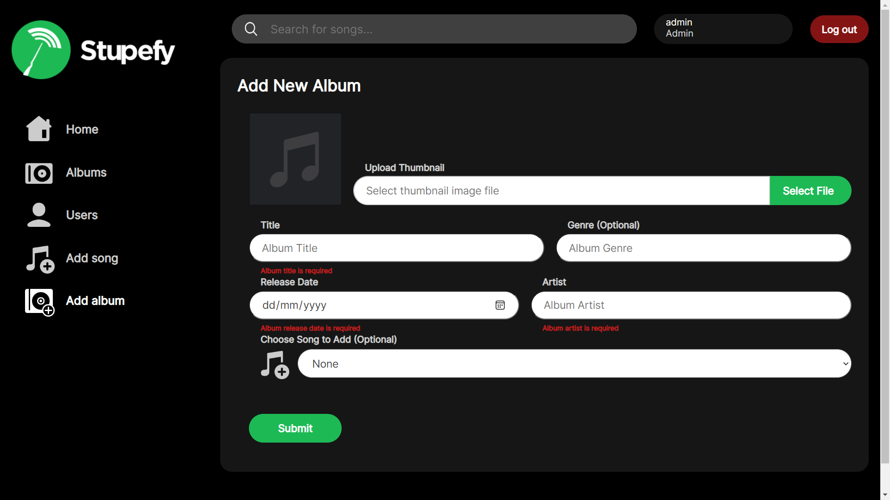
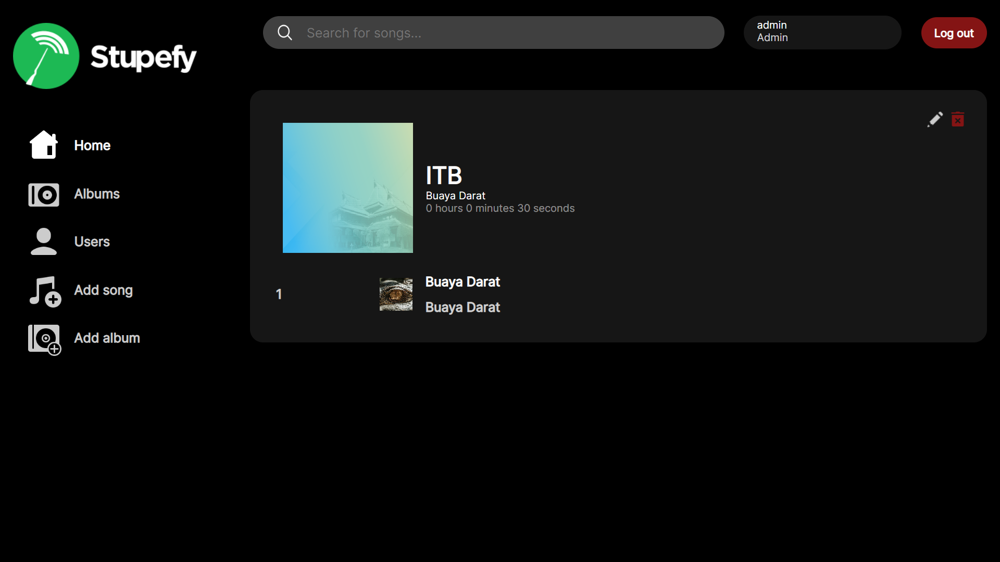

# Stupefy
## Tugas Besar 1 - IF3110 Pengembangan Perangkat Lunak Berbasis Web<br>
Pengembangan aplikasi berbasis web menggunakan vanilla PHP, CSS, HTML, dan JS

## Author
- Ahmad Romy Zahran (13520009)
- Firizky Ardiansyah (13520095)
- Muhammad Fahmi Irfan (13520152)
  
## 1. Penjelasan Singkat
Stupefy merupakan perangkat lunak berbasis web yang memiliki fungsionalitas untuk memutar lagu, menyimpan lagu, mengumpulkan lagu dalam album dan sebagainya. Fungsionalitas ini bergantung pada *role* masing-masing pengguna. Pengguna dibedakan menjadi *guest*, *user*, dan *admin*. Masing-masing memiliki autorisasinya sendiri. Perangkat lunak ini dibangun menggunakan beberapa ketentuan berikut:
1. Client side: HTML, CSS, JavaScript
2. Server side: Vanilla PHP
3. Database: MySQL


## 2. Requirements
1. Docker
2. MySQL
3. Browser

## 3. Cara Instalasi
1. Clone/Download repository ini.
2. Buatlah file ```.env``` pada root folder, salin field yang perlu diisi dari .env.example (jika sudah terisi, tidak perlu di ubah).
3. Jalankan ```./scripts/build-image.sh``` menggunakan bash yang mendukung ekstensi .sh (contoh: git bash).
4. Tunggu hingga semua image berhasil di-*pull*.

## 4. Cara Menjalankan Server 
1. Cara menjalankan server dapat dilakukan dengan menggunakan perintah, jika baru pertama kali menjalankan server ini pada docker Anda.
    ```
    docker-compose up -d --build
    ```
2.  Jika sudah pernah, cukup dengan 
    ```
    docker-compose up -d
    ```
3. Jika sudah selesai dijalankan, lakukan migrasi untuk menginisialisasi basis data. gunakan perintah berikut
   ```
   docker exec {nama container server} -it //bin//bash ./scripts/run-migration.sh
   ```
   defaultnya, nama container server dari web ini adalah ```stupefy-web-server-1```, namun Anda bisa melihat nama container server yang dijalankan menggunakan ```docker container ls```. Secara default, untuk melakukan migrasi dapat menjalankan perintah berikut ini.
   ```
   docker exec stupefy-web-server-1 -it //bin//bash ./scripts/run-migration.sh
   ```
4. Jika ingin mempopulasi basis data, Anda dapat menggunakan perintah berikut ini.
   ```
   docker exec {nama container server} -it //bin//bash ./scripts/run-seed.sh
   ```
   atau secara default
   ```
   docker exec stupefy-web-server-1 -it //bin//bash ./scripts/run-seed.sh
   ```
5. Hasil seeder memberikan sebuah akun Admin dengan username = `admin` dan password = `admin`. 
6. Jalankan web pada `localhost:8080`.


## 5. Screenshot Layar
### 5.1. Halaman Login
#### *Screen Capture*


### 5.2. Halaman Register
#### *Screen Capture*


### 5.3. Halaman Dashboard
#### *Screen Capture*


### 5.4. Halaman Pencarian, Filter, dan Sort
#### *Screen Capture*


### 5.5. Halaman Penambahan Lagu
#### *Screen Capture*


### 5.6 Detail Lagu
###  *Screen Capture*


### 5.7 Pengubahan Detail Lagu
###  *Screen Capture*


### 5.8 Penambahan Album Baru
###  *Screen Capture*



### 5.9 Detail Album
###  *Screen Capture*


### 5.10 Pengubahan Detail Album
###  *Screen Capture*


## 6. Pembagian Tugas
**Server-side**
| Fitur  | 13520009 | 13520095 | 13520152 |
| --- | --- | --- | --- |
| Login | :white_check_mark: | | |
| Register   | :white_check_mark: |  |  |
| Dashboard   |  | :white_check_mark: |  |
| Pencarian, Filter, dan Sort   | :white_check_mark: |  |  |
| Pagination   | :white_check_mark: |  |  |
| Penambahan Lagu Baru  |  | :white_check_mark: |  |
| Penghapusan Lagu  |  |  | :white_check_mark: |
| Detail Lagu  |  | :white_check_mark: | :white_check_mark: |
| Pengubahan Detail Lagu  |  | :white_check_mark: | :white_check_mark: |
| Penambahan Album Baru  |  | :white_check_mark: |  |
| Penghapusan Album  |  | :white_check_mark: |  |
| Detail Album  |  |  | :white_check_mark: |
| Pengubahan Detail Album  |  | :white_check_mark: |  |
| Database  |  | :white_check_mark: |  |

**Client-side**

| Fitur  | 13520009 | 13520095 | 13520152 |
| --- | --- | --- | --- |
| Login | :white_check_mark: | :white_check_mark: |  |
| Register   | :white_check_mark: | :white_check_mark: |  |
| Dashboard   |  | :white_check_mark: |  |
| Pencarian, Filter, dan Sort   | :white_check_mark: |  |  |
| Pagination   | :white_check_mark: |  |  |
| Penambahan Lagu Baru  |  | :white_check_mark: |  |
| Penghapusan Lagu  |  |  | :white_check_mark: |
| Detail Lagu  |  |  | :white_check_mark: |
| Pengubahan Detail Lagu  |  | :white_check_mark: | :white_check_mark: |
| Penambahan Album Baru  |  | :white_check_mark: |  |
| Penghapusan Album  |  |  | :white_check_mark: |
| Detail Album  |  | :white_check_mark: | :white_check_mark: |
| Pengubahan Detail Album  |  | :white_check_mark: | :white_check_mark: |

## 7. Credential Hasil Seeder
**1. User**
```
username: test
password: test
```
**2. Admin**
```
username: admin
password: admin
```
